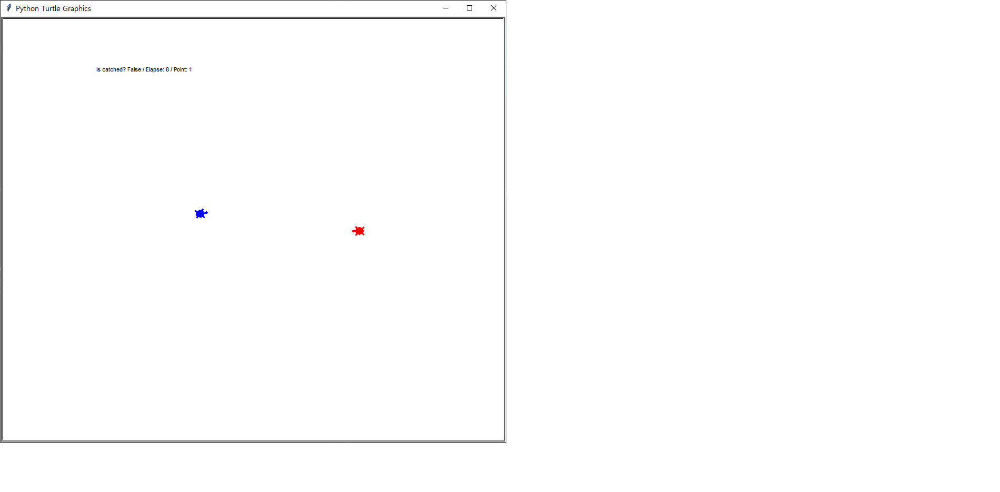

# Turtle Runaway

도망가는 **거북이**를 잡아라!
도망가는 거북이를 붙잡고 점수를 획득하세요!

- 게임 시작 시, 거북이들이 마주보고 시작합니다.
  
- 파란 거북이는 빨간 거북이를 피해 도망을 칩니다.
- 빨간 거북이는 플레이어가 조종하는 거북이로, 키보드 방향키를 이용해 조종할 수 있습니다.
- 빨간 거북이를 조종해 파란 거북이를 붙잡는 것이 게임의 **목표**입니다!

- 빨간 거북이를 조종해 파란 거북이를 잡으면, 점수를 1점 획득하고 각 거북이들은 초기 자리로 돌아갑니다!
- 친구와 시간 안에 몇 점을 먼저 잡는지 내기를 해보십시오! 즐거운 시간일 것입니다
